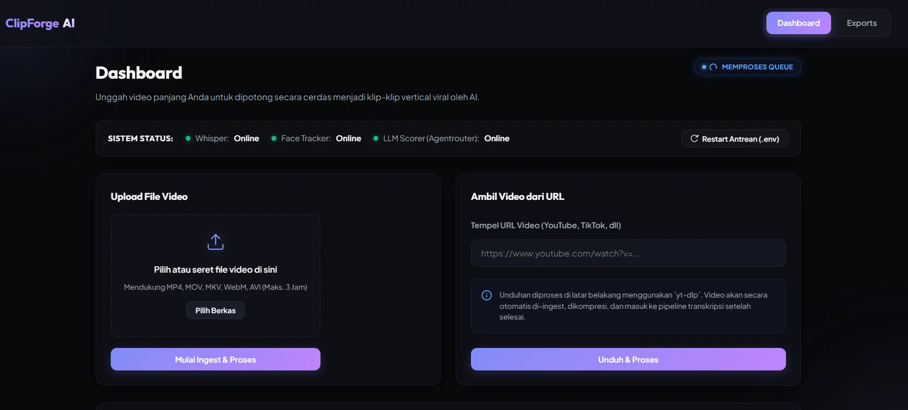
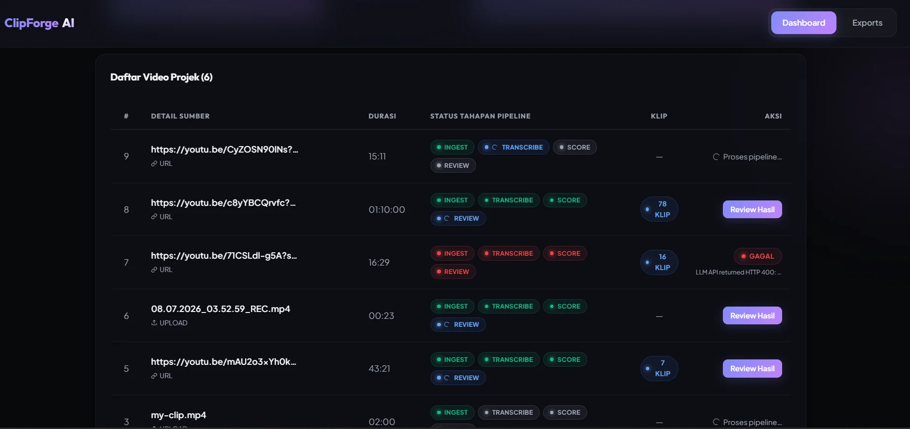
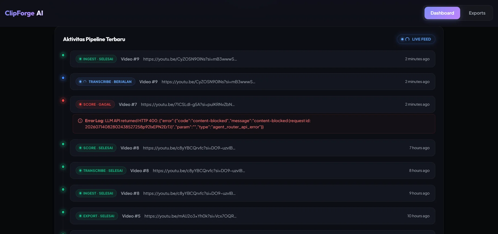
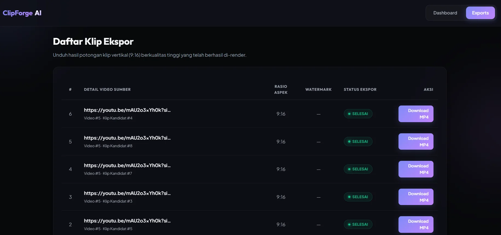
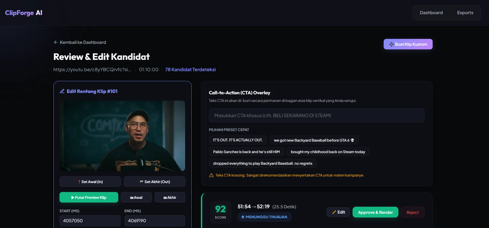

# 🎬 ClipForge AI

> **ClipForge AI** is a powerful, self-hosted, automated pipeline designed to convert long-form videos (podcasts, webinars, livestreams, raw UGC) into short, vertical (9:16), captioned, and watermark-ready clips suitable for Reels, Shorts, and TikTok. 

It functions similarly to services like OpusClip or Vizard, but runs entirely on your own hardware, keeping your data private and avoiding recurring SaaS fees.

---

## 📸 User Interface Showcase

Below are screenshots of the premium obsidian-dark glassmorphism dashboard and the built-in video editor:

| Main Dashboard & Pipeline Status | Live Video Editor Workspace |
| :---: | :---: |
|  |  |

| Export & Final Deliverables | Activity Feed & Pipeline Timeline |
| :---: | :---: |
|  |  |

| Video Ingest & Queue Manager |
| :---: |
|  |

---

## 🛠️ Architecture & Pipeline Overview

The system is built on **Laravel 13** as the orchestrator, backed by **SQLite (WAL)**, with heavy asynchronous processing running via a robust queued job system. 

```
Ingest ──→ Transcribe ──→ Score Highlights ──→ Reframe & Caption ──→ Export & Deliver
```

| Stage | Responsibility | Key Technology / Stack |
|---|---|---|
| **1. Ingest** | Validates uploaded videos or public URLs, handles security checks (SSRF / magic bytes), and stores files. | Laravel HTTP + `yt-dlp` + `ffprobe` |
| **2. Transcribe** | Generates word-level timestamped transcripts. | `faster-whisper` (Python microservice) |
| **3. Score** | Identifies engaging highlights and ranks candidate clip time ranges. | Ollama (`qwen2.5:7b` / `llama3.2:3b`) |
| **4. Reframe** | Crops video to vertical 9:16 keeping the speaker centered; burns in captions. | MediaPipe (Face tracking) + `ffmpeg` + ASS templates |
| **5. Export** | Applies watermark overlays and packages the final `.mp4` file for delivery. | `ffmpeg` + Livewire Web Dashboard |

---

## 🚀 Key Improvements & Audit Fixes

The codebase has been thoroughly audited and hardened with the following enhancements:
*   **OOM Prevention:** File uploads to internal Python services are now streamed via resource pointers (`fopen`) instead of memory-heavy strings, preventing crashes on videos up to 2 GB.
*   **Double-Approval Protection:** Prevented duplicate exports and wasted rendering cycles by locking candidate states upon approval.
*   **Self-Healing Timestamps:** Added automatic detection and correction for cases where the LLM returns seconds instead of milliseconds.
*   **Windows Directory Separator Fixes:** Resolved string manipulation bugs that left orphan files on Windows systems.
*   **Context Window Tuning:** Explicitly configured Ollama's `num_ctx` to `4096` in code to prevent massive VAD/KV-cache allocations, keeping model execution fast and light on 16GB RAM devices.

---

## 📋 Prerequisites

Ensure you have the following installed on your machine:
*   **PHP 8.5+** & **Composer**
*   **FFmpeg** and **FFprobe** added to your system's PATH
*   **Python 3.11** (for running the whisper and reframe services)
*   **Ollama** (running locally on port `11434`)

---

## ⚙️ Setup & Installation

### 1. Clone & Install Laravel Orchestrator
```bash
composer install
cp .env.example .env
php artisan key:generate
php artisan migrate
```

### 2. Configure Environment Variables (`.env`)
Ensure paths to external binaries match your system setup:
```env
AUTOCLIP_FFMPEG_PATH=ffmpeg
AUTOCLIP_FFPROBE_PATH=ffprobe
AUTOCLIP_YTDLP_PATH=yt-dlp
```

### 3. Pull LLM Model via Ollama
Ensure Ollama is running and download the default highlight scoring model:
```bash
ollama pull qwen2.5:7b
```

### 4. Setup Python Whisper Service
```bash
cd services/whisper
python -m venv .venv
.venv\Scripts\activate      # Windows (or source .venv/bin/activate on Unix)
pip install -r requirements.txt
```

---

## 💻 Running the Services Locally

To run the complete system, launch the following processes in separate terminal sessions:

### 1. Web Application & API
```bash
php artisan serve
```
Access the dashboard at [http://127.0.0.1:8000](http://127.0.0.1:8000).

### 2. Queue Worker (Processes the Pipeline)
```bash
php artisan queue:work --tries=3
```

### 3. Whisper Transcription Service
```bash
cd services/whisper
.venv\Scripts\activate      # Windows
python app.py               # Runs on port 9000
```

---

## 🧪 Testing the Suite
The project comes with a comprehensive test suite (130 tests) that uses fakes and mocks, allowing you to run verification without any external service dependencies:
```bash
php artisan test
```
